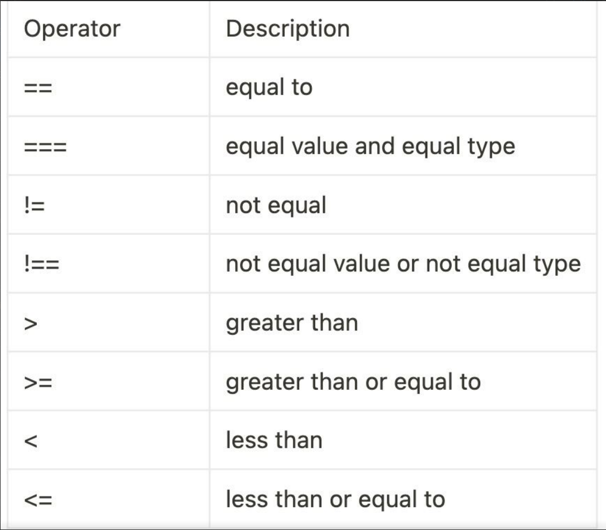

# Lesson - 1

### Some info about Js

    Javascript ulanishi:

    <script src= "./script.js"></script> tag yordamida HTML filening body ning ichida eng pastki qismida yoki body dan tashqarida ya'ni html tagining ichida eng pastki qismida yoziladi. Chunki o'zidan yuqoridagi barcha kodlarni kuzatib turoladi.

```

Input:
    prompt("....");       -->  Ma'lumotlarni kiritish


Output:
    alert("...");         -->  Ogohlantirish oynasi
    confirm("...");       -->  Ma'lumotlarni tasdiqlash


    console.log("...");   -->  Consolega chiqarish


Js cases:
    var varName = "value"; //camel case(recommended)
    var VarName = "value"; // pascal case
    var var_name = "value"; //snake case


Operators:
    +   -   *   /   %


getElementById - elementni id orqali olish


```

<br>

## Data type

#### Primative:

    1. Number: 1234567890
    2. String: "smth", 'smth'
    3. Boolean: true & false
    4. Undefined: o'zgaruvchi ochib unga qiymat berilmasa u       undefined hisoblanadi.
    5. Null: o'zgaruvchi bor, nomi ham bor lekin ichi bo'shligi etsak, uni Null deb yozamiz.
    6. BigInt
    7. Symbol

#### Non Primative:

    8. Object

<br>

## Variables in Js

```
var - qayta o'zgaruvchi yaratsa bo'ladi, qayta qiymatini tayinlash va qayta e'lon qilish ham m-n.

let - qayta qiymatni tayinlash, yaratilgan o'zgaruvchini qayta yaratib bo'midi

const - o'zgarmas, qiymatni o'zgartirib bo'lmaydi, qayta qiymat e'lon qilish m-n emas.
```

- **var** - global
- **let**- local
- **const** - local

---

<br>

**NAN** - not a number
<br>
<br>

# Typeof - qanday tipdaligini aniqlaydi.

```
let str = "smth";
console.log(typeof str); -> string

let count = 1;
console.log(typeof count); -> number

let isActive = true;
console.log(typeof isActive); -> boolean

Null ni typeof qilib tekshirganimizda object qaytaradi. Lekin non-primative hisoblanmaydi.

```

<br>
<br>

# Number

```
console.log(1 / 0); -> infinity(cheksiz)
console.log("124" / 2); type conversion
console.log("smth" - 10); NaN -> not a number
console.log("10" + 12); -> bunday keltirilgan misollar string ko'rinishiga keb qoladi ya'ni 1012 chiqadi. Agar boshqa amallardan foydalansak bunday bo'lmaydi.
Masalan:

console.log("10" - 5); -> 5
console.log("12" / 2); -> 6

Agar number bn boolean kelsa, boolean matematik ko'rinishga keladi. 0 va 1

0 - false
1 - true

console.log(16 + true) -> 17
console.log(16 - true) -> 15
console.log(16 - false) -> 16
console.log(16 / false) -> infinity


Javascriptda bir kichik bug bor:

console.log(0.1 + 0.2) -> 0.300000000004


console.log(16e6) -> exponential

Ya'ni: 16 e6 - shuncha nollar borligi shunda 16 dan kn 6ta nollar bo'lishi 16 000000


BigInt - console.log(1222222222n) -> n - yana nimadir borligini bildiradi.

2 ^ 53 dan keyingi son BigInt hisoblanadi.

```

<br>
<br>

# Undefined

```
let name;
console.log(name);
```

<br>
<br>

# Null

```
let select = null;
console.log(typeof select); -> js bug
```
<br>
<br>

# Arifmetic

```
num + str = str
num / * - str(num) = num
str(num) / * - str(num) = num
others - NaN
```

<br> <br>

# Assignment 
- __Assignment__ - o'zlashtirish

```
a = 10
b = 5
a += b -> a = a + b
```
<br> <br>

# Compare -> taqqoslash



    10 * 10 = 10**2 -> 10 ning 2 chi darajasi.

<br>
<br>

# Logical 
- __Logical__ - mantiqiy

```

&& -> and 
false qiymatni chiqaradi. Ya'ni: (0 && 1) bo'lsa javob 0 chiqadi.


falty: 0, false, "", null, undefined, NaN
truthy: 1, true, "smth", 1234...  
```
