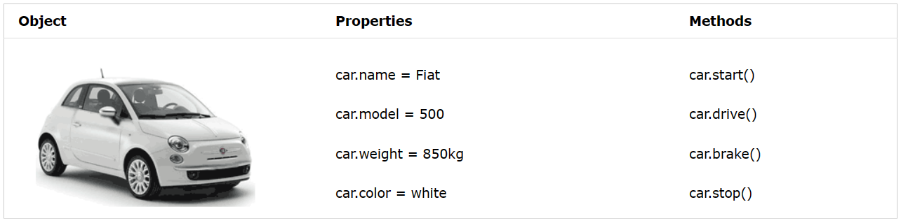
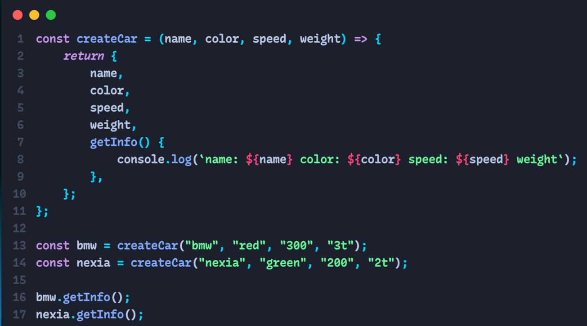
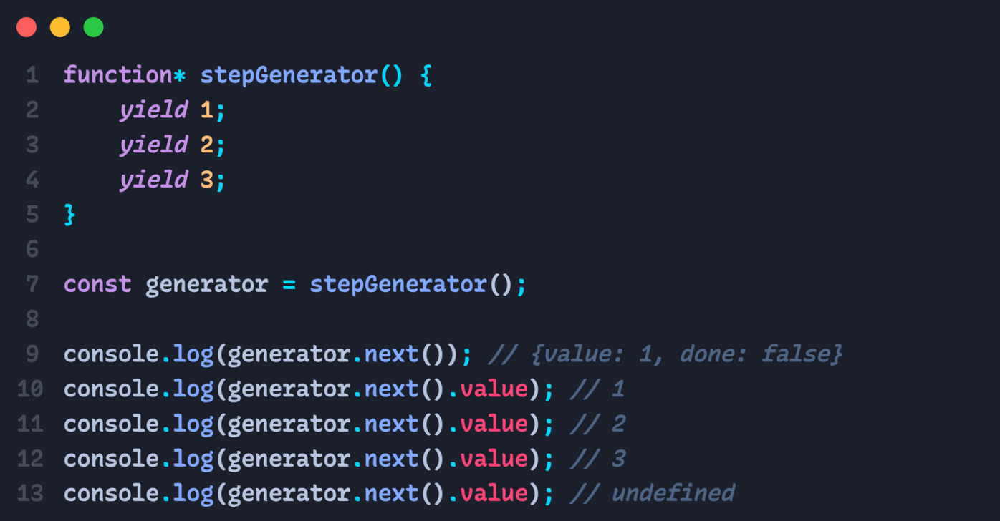

# LESSON-13

1. **Object**
   - Object Create
   - Object Methods

### Real Life Objects, Properties, and Methods <br>

In real life, a car is an object.

A car has properties like weight and color, and methods like start and stop:



All cars have the same properties, but the property values differ from car to car.

All cars have the same methods, but the methods are performed at different times.

## Object create:

// Object instance:

```
// bu holat ko'pincha ishlatilmidi.

const person = new Object(){
    name: "Komil",
    age: 20,
    isStudent: false,
};

console.log(person);
```

<br>

// Object literal syntax:

```
const person = {
    name: "Kamila",
    age: 19,
    isStudent: true,
    hobbies: ["reading books", "cookings", "drawing"],
};

console.log(person);

// name, age, isStudent, hobbies -- key
// "Kamila", 19, true ... -- value
```

<br>

**Agar person ichidagi ma'lumotlarga murojaat qilmoqchi bo'lsa:**

```
console.log(person['age']); // 19

console.log(person.hobbies[1]); // cookings
```

<br>

**Dynamic holatda data qo'shish:**

```
const person = {

}

person.name = "Madina";
```

<br>

**Object ichida object ochish mumkun !**

<br>

## Object ichidagini o'chirish uchun:

```
const person = {
    name: "Kamila",
    age: 19,
    isStudent: true,
    hobbies: ["reading books", "cookings", "drawing"],
};

delete person.age; // age o'chib ketadi.
console.log(person);
```

<br>

**Object ichida funksiya kelsa, metod bo'ladi !**

```
const laptop = {
    brand: "Apple",
    name: "Macbook Pro",
    color: "silver",
    getFullName: function(){
        console.log("Apple, Macbook Pro Silver 16GB");
    }
}

laptop.getFullName()
```

<br>

## Accessing Object Properties

**You can access object properties in two ways:**

```
objectName.propertyName
```

**or**

```
objectName["propertyName"]
```

<br>

## This

- **This** - object ichida kelsa, shu object o'ziga teng.


```
console.log(this) // global window
```

<br>


```
function test(){
    console.log(this) // undefined when there is "use strict".
}

test()
```
<br>

```
const exp = function() {
    console.log(this) // undefined when there is "use strict".
}

exp()
```
<br>

```
const arrow = () => {
    console.log(this) // global window
}

arrow()
```

## Object Methods

- __Method__ -- bo'lish uchun biron-bir key funksiyaga teng bo'lishi k-k.

```
 Object.keys({}) -> Object keys in array format
 Object.values({}) -> Object values in array format
 Object.entries({}) -> Array of elemnt ['key', 'value']
 Object.fromEntries({}) -> Array to orginal Object
 Object.assign({//target zone},{}) -> deep copy object
 Object.freeze({}) -> Object freeze object
```
<br>

**For in** -- arrga nisbatan qo'llansa, elementlarni __index__ ini ob beradi. Objectga nisbatan elementni __key__ ni ob beradi.

**For of** -- arrga nisbatan qo'llansa, elementlarni ob beradi. Objectga nisbatan ishlamidi.

<br>

## Deep copy and Shallow copy

<br>

__Deep copy__ -- chuqur nusxalash. Copy qib olingan elementga o'zgartirish kiritilsa, orginalga ta'sir ko'rsatilmidi. For loop orqali biron-bir arrni elementlarini boshqa bir arrga push qib olinsa deep copy bo'ladi.

```
let arr = [1, 2, 3, 4]
let b = [] 

for(let i = 0; i < arr.length; i++){
    b.push(arr[i]) // deep copy
}

b.push(5)

console.log(arr) // 1, 2, 3, 4
console.log(b) // 1, 2, 3, 4, 5
```
<br>

__Shallow copy__ -- sayoz nusxalash. Boshqa bir o'zgaruvchiga tenglab olish.

```
let arr = [1, 2, 3, 4]
let b = arr //shallow copy

b.push(5)

console.log(arr) // 1, 2, 3, 4, 5
console.log(b) // 1, 2, 3, 4, 5
```

### Eng zo'r deep copy

```
let arr = [1, 2, 3, 4]
let b = [...arr]

b.push(5)

console.log(arr) // 1, 2, 3, 4
console.log(b) // 1, 2, 3, 4, 5
```
<br>

## Pure & Impure


__Pure__ -- global scope ga ta'sir ko'rsatsa va shunchaki kelgan argumentlarni execute qilib return qiladi

__Impure__ -- global scope ga ta'sir ko'rsatmasa va kelgan argumentlarni global o'zgaruvchiga yig'ib olib return qilishi


<br>


## Callback

- Funsksiyalarni ketma-let ishlatish. Funksiyalarni ichidagi argument ketma-ketligini call qilish mumkun. 

<br>


## Closure

- Global skopdan o'zgaruvchini qabul qilishi, agar o'zini environmentida bo'lmasa globaldan oladi shu holatga closure function deymiz

<br>


## Lexical environment 

- Funksiyaning ichida biron-bir o'zgaruvchi ishlashiga access berish,funksiya ichida keladigan holat

<br>


## HOF - Higher order function 

- Funksiya ichida boshqa bir funksiyani return qilishi

<br>

## Currying Func

- Currying function har bir stepda nimadir ish bajaralishi mn bolgan holatda ishlatiladi

```
// const f = (a, b, c, d) => {
//     a += 10;
//     return a + b + c + d;
// };

// const a = (a) => {
//     a += 10;
//     return (b) => {
//         b++;
//         return (c) => {
//             c -= 1;
//             return (d) => {
//                 d *= 5;
//                 return a + b + c + d;
//             };
//         };
//     };
// };

// console.log(summa);
// console.log(1, 2, 3, 4);

// console.log(a(1)(2)(3)(5));

```
<br>

## Pipe Func

- Pipe function ichkaridan tashqariga qarab ishlaydi. Tasklarni ketma-ketlikda ishlaydi.


<br>


## Factory Func

- return new object



<br>


## Generator Func

- Generatsiya qilib beradi.

- Yield bu - step (qadam)



